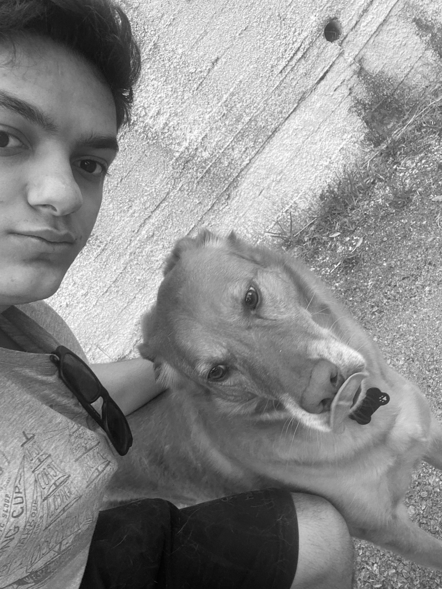
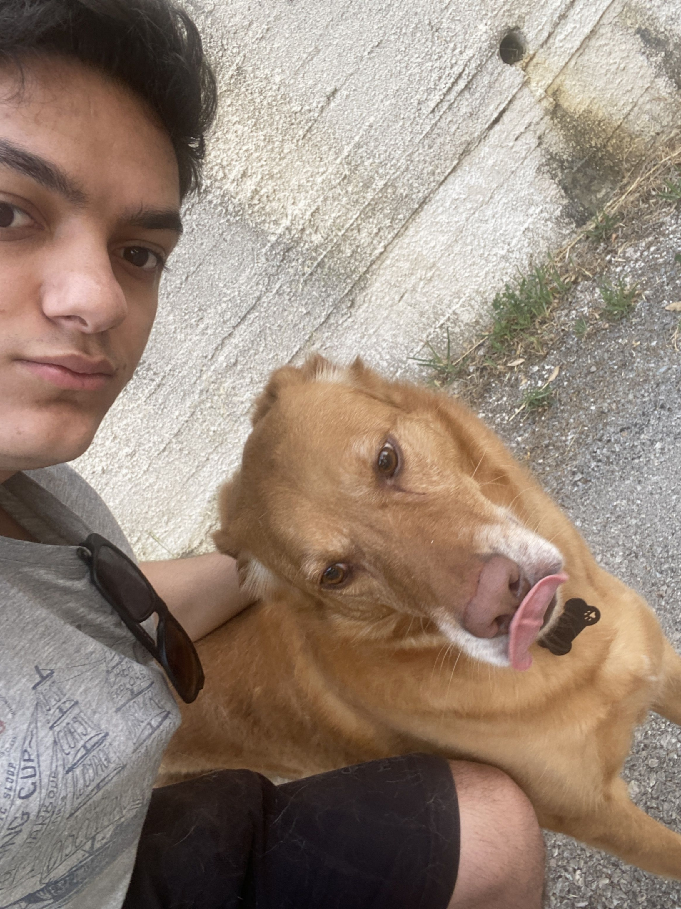
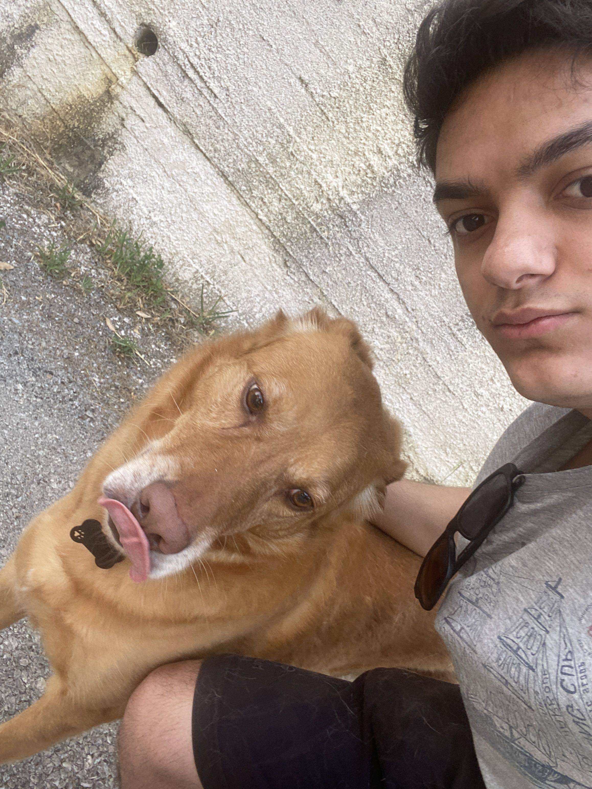
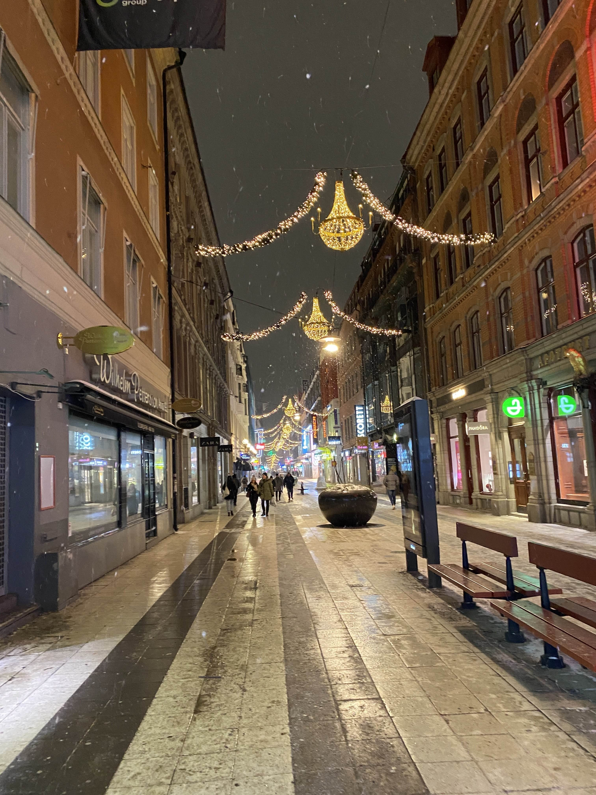

# BMP Image Filter in C++

This project is a C++ image filtering program for 24-bit BMP images. It applies visual effects using raw file access and pixel-by-pixel manipulation. It demonstrates low-level image processing and good modular C++ design.

It was originally built as part of the CS50 Memory problem set, but rather than using their distribution code and building it in C,
I decided to build everything from scratch (as much as possible, online help was used) and in C++.

---

## Features

- Grayscale (gamma-corrected, linear color space)

- Blur (box blur kernel)

- Sobel Edge Detection (based on gradient magnitude)

- Reflect (horizontal mirror)

- Easy to extend — filters live in a modular `ImageFilters` namespace

---

## Build Instructions

### On Windows (with MSVC)

1. Open **Developer Command Prompt for Visual Studio**
2. Run:

```bash
cl src\main.cpp src\filters.cpp /I include /W4 /EHsc /Fe:filter.exe
```
3. Then run the program.

### On Linux / WSL / MinGW
```bash
g++ src/main.cpp src/filters.cpp -Iinclude -o filter
./filter
```

---

## Concepts Demonstrated
1. Manual parsing of BMP headers & pixel data

2. Binary file I/O

3. Gamma correction using linear light space

4. Sobel gradient convolution (edge detection)

5. Structs, vectors, and clean namespace usage in C++

---

## Sample Use
When the program runs, it prompts you to

1. Enter a .bmp image filename

2. Select a filter (blurred, grayscaled, reflected, edges)

3. It saves the new image as: grayscaled_input.bmp, blurred_input.bmp, etc.

---

## Sample Output

Files are showcased in .jpg despite the program interacting only with .bmp files simply because they're smaller size to upload

### Original:


### Grayscaled:


### Blurred:


### Reflected:


### Edge Detection:



---

## Known Issues
1. Program fails to apply filters to images not in parent directory even if given correct path
2. It also seems to not be able to open images that weren't present before the program was ran

---
## Possible improvements

- I hope to add more features in the future:
    1. More color tints, a sharpen, and other types of filters.
    2. a GUI.
    3. Improve performance as I feel right now it's slower and hogs more memory than it needs to.
    4. Expand image format support

- But I suppose for now it's finished, and I can come back to it when I improve my skills.


## License

This project is licensed under the [MIT License](LICENSE).
